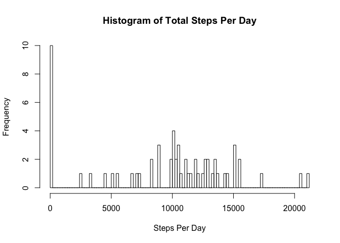
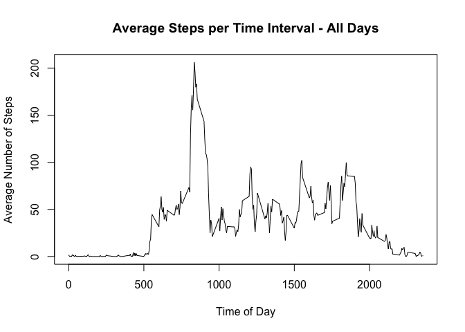
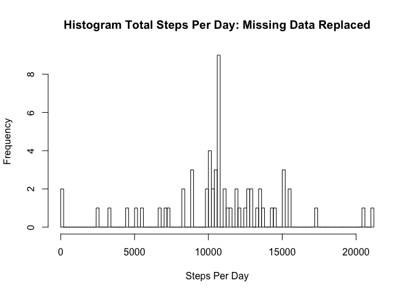
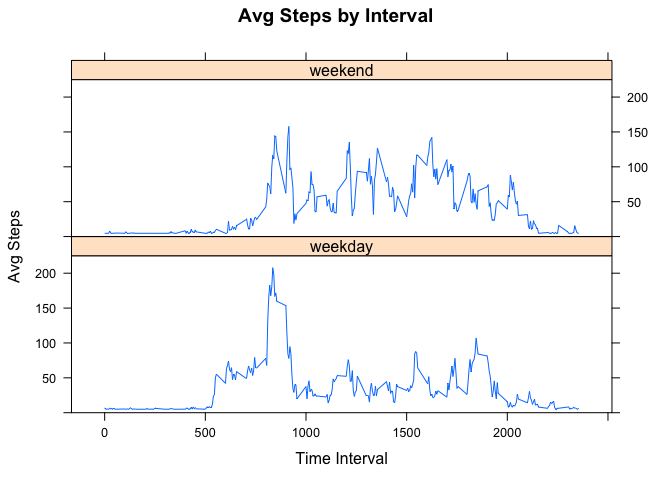

Loading and preprocessing the data
----------------------------------

We start by downloading the .zip file from:
<https://d396qusza40orc.cloudfront.net/repdata%2Fdata%2Factivity.zip>

We then unzip and load the .csv file into data.frame 'activity'

    temp <- tempfile()
    download.file("https://d396qusza40orc.cloudfront.net/repdata%2Fdata%2Factivity.zip",temp)
    activity <- read.csv(unz(temp, "activity.csv"))
    unlink(temp)

Steps Per Day
-------------

Next we calculate the total number of steps taken per day using the
'plyr' package and the 'ddply' function.

We then make a histogram of the total number of steps taken each day and
find the mean and median of the total number of steps taken per day.

    options(repos=structure(c(CRAN="http://cran.case.edu/")))
    install.packages("plyr")

    ## 
    ## The downloaded binary packages are in
    ##  /var/folders/cp/pwf7ntbx7j96bx3j9r7n5h0c0000gn/T//RtmpNj7UqZ/downloaded_packages

    library(plyr)
    stepsPerDay <- ddply(activity,~date,summarise,sum=sum(steps,na.rm=TRUE))
    hist(stepsPerDay$sum,100,xlab="Steps Per Day",main="Histogram of Total Steps Per Day")

    cat("Average Number of steps per day = ",mean(stepsPerDay$sum))

    ## Average Number of steps per day =  9354.23

    cat("Median Number of steps per day = ",median(stepsPerDay$sum))

    ## Median Number of steps per day =  10395

Average Daily Activity Pattern
------------------------------

We now plot the Average Number of Steps Taken by 5-minute Intervals
across all days.

We also determine and report which interval has the highest step
average.

    intervalAvg <- ddply(activity,~interval,summarise,mean=mean(steps,na.rm=TRUE))
    plot(intervalAvg$interval,intervalAvg$mean,type="l",xlab="Time of Day",ylab="Average Number of Steps",main="Average Steps per Time Interval - All Days")

    cat("The Time Interval with the highest average is",intervalAvg[which(intervalAvg$mean==max(intervalAvg$mean)),1])

    ## The Time Interval with the highest average is 835

Missing Values
--------------

We first determine how many time intervals have 'NA' as their data.

    cat("There are ",sum(is.na(activity$steps))," time intervals that do not have data")

    ## There are  2304  time intervals that do not have data

Missing Values
--------------

We will now replace all NA's with the mean value for that time interval
across all 61 days, and then plot the Average Number of Steps Taken by
5-minute Intervals across all days.

We also determine and report which interval has the highest step
average.

    activity2 <- activity
    activity2$steps[is.na(activity2$steps)] <- mean(activity2$steps, na.rm = TRUE)

    stepsPerDay2 <- ddply(activity2,~date,summarise,sum=sum(steps))
    hist(stepsPerDay2$sum,100,xlab="Steps Per Day",main="Histogram Total Steps Per Day: Missing Data Replaced")

    cat("Average Number of steps per day after imputing missing data = ",mean(stepsPerDay2$sum))

    ## Average Number of steps per day after imputing missing data =  10766.19

    cat("Median Number of steps per day after imputing missing data = ",median(stepsPerDay2$sum))

    ## Median Number of steps per day after imputing missing data =  10766.19

Weekends and Weekdays distinguished
-----------------------------------

We now distinguish whether a day is a weekday or weekend day using the
weekdays() function. This gives us the day of the week, which we use to
add a factor variable equal to 'weekday' or 'weekend'.

    dayType <- weekdays(as.Date(activity2$date))
    activity2$weekend <- matrix(0,nrow(activity2),1)
    activity2$weekend <- dayType=="Saturday"|dayType=="Sunday"
    activity2$weekend = factor(activity2$weekend,labels=c("weekday","weekend"))
    intervalAvg2 <- ddply(activity2,~interval+weekend,summarise,mean=mean(steps))

Weekends and Weekdays distinguished - Plotting Avg Steps per Interval
---------------------------------------------------------------------

We now use the 'lattice' package to make a panel plot of the Average
Steps by Time Interval over all days, with separate plots for Weekend
Days and WeekDays.

    options(repos=structure(c(CRAN="http://cran.case.edu/")))
    install.packages("lattice")

    ## Error in install.packages : Updating loaded packages

    library(lattice)
    xyplot(intervalAvg2$mean~intervalAvg2$interval|intervalAvg2$weekend,type="l",layout=c(1,2),xlab="Time Interval",ylab="Avg Steps",main="Avg Steps by Interval",ylim=c(0,225))

